# RCGS メタデータスキーマ データモデル

このドキュメントは、RCGSプロジェクトで使用されるSHACLメタデータスキーマに基づいたデータモデルの構造を説明します。

## 概要

RCGSメタデータスキーマは、ゲーム作品を中心とした包括的なメタデータモデルで、作品の概念的側面から物理的な所蔵まで、そして関連する主体や技術的要素まで体系的に記述できる構造になっています。

## データモデル図

### 1. サブクラス表示ありのデータモデル

```mermaid
graph TB
    %% 主要エンティティ
    Work["Work<br/>(作品)"]
    Variation["Variation<br/>(バリエーション)"]
    Package["Package<br/>(パッケージ)"]
    PhysicalPackage["PhysicalPackage<br/>(物理パッケージ)"]
    OnlinePackage["OnlinePackage<br/>(オンラインパッケージ)"]
    Item["Item<br/>(個別資料)"]
    Agent["Agent<br/>(主体)"]
    Person["Person<br/>(個人)"]
    Organization["Organization<br/>(組織)"]
    Platform["Platform<br/>(プラットフォーム)"]
    Device["Device<br/>(装置)"]
    Topic["Topic<br/>(トピック)"]
    ContentRating["ContentRating<br/>(年齢レーティング)"]
    MediaFormat["MediaFormat<br/>(メディア形式)"]
    Contribution["Contribution<br/>(貢献)"]
    ProvisionActivity["ProvisionActivity<br/>(供給活動)"]
    MediaTypeOrExtent["MediaTypeOrExtent<br/>(メディア種別・範囲)"]
    RelatedInstance["RelatedInstance<br/>(関連資料)"]
    AdminMetadata["AdminMetadata<br/>(管理メタデータ)"]

    %% サブクラス関係
    Package --> PhysicalPackage
    Package --> OnlinePackage
    Agent --> Person
    Agent --> Organization

    %% 主要な関連
    Work -.->|"rcgs:variation"| Variation
    Work -.->|"rcgs:embodiment"| Package
    Variation -.->|"rcgs:variationOf"| Work
    Variation -.->|"rcgs:embodiment"| Package
    Package -.->|"rcgs:embodimentOf"| Variation
    Package -.->|"rcgs:embodiedWork"| Work
    Package -.->|"rcgs:exemplar"| Item
    Item -.->|"rcgs:exemplarOf"| Package

    %% エージェント関係
    Work -.->|"dcterms:creator"| Agent
    Work -.->|"schema:productionCompany"| Agent
    Variation -.->|"rcgs:contribution"| Contribution
    Contribution -.->|"rcgs:agent"| Agent
    Package -.->|"rcgs:producer"| Agent
    Package -.->|"rcgs:publisher"| Agent

    %% プラットフォーム・装置関係
    Variation -.->|"schema:gamePlatform"| Platform
    Package -.->|"schema:gamePlatform"| Platform
    Platform -.->|"rcgs:deviceImplimented"| Device
    Variation -.->|"rcgs:specialHardware"| Device

    %% トピック関係
    Work -.->|"schema:genre"| Topic
    Work -.->|"rcgs:theme"| Topic
    Work -.->|"schema:about"| Topic
    Work -.->|"schema:character"| Topic

    %% メディア・レーティング関係
    Package -.->|"dcterms:format"| MediaTypeOrExtent
    Package -.->|"schema:contentRating"| ContentRating
    MediaTypeOrExtent -.->|"schema:encodingFormat"| MediaFormat
    Device -.->|"schema:encodingFormat"| MediaFormat

    %% 供給活動
    Package -.->|"rcgs:provisionActivity"| ProvisionActivity

    %% 管理メタデータ
    Work -.->|"rcgs:adminMetadata"| AdminMetadata
    Variation -.->|"rcgs:adminMetadata"| AdminMetadata
    Package -.->|"rcgs:adminMetadata"| AdminMetadata

    %% 階層関係
    Work -.->|"dcterms:isPartOf/hasPart"| Work
    Variation -.->|"dcterms:hasVersion/isVersionOf"| Variation
    Package -.->|"dcterms:isPartOf/hasPart"| Package
    Topic -.->|"dcterms:isPartOf/hasPart"| Topic

    %% スタイル
    classDef primaryEntity fill:#e1f5fe,stroke:#01579b,stroke-width:2px
    classDef subEntity fill:#f3e5f5,stroke:#4a148c,stroke-width:2px
    classDef supportEntity fill:#fff3e0,stroke:#e65100,stroke-width:2px

    class Work,Variation,Package,Item primaryEntity
    class PhysicalPackage,OnlinePackage,Person,Organization subEntity
    class Platform,Device,Topic,ContentRating,MediaFormat,Contribution,ProvisionActivity,MediaTypeOrExtent,RelatedInstance,AdminMetadata supportEntity
```



### 2. シンプル表示（サブクラス非表示）のデータモデル

```mermaid
graph TB
    %% 主要エンティティ（サブクラスなし）
    Work["Work<br/>(作品)"]
    Variation["Variation<br/>(バリエーション)"]
    Package["Package<br/>(パッケージ)"]
    Item["Item<br/>(個別資料)"]
    Agent["Agent<br/>(主体)"]
    Platform["Platform<br/>(プラットフォーム)"]
    Device["Device<br/>(装置)"]
    Topic["Topic<br/>(トピック)"]
    ContentRating["ContentRating<br/>(年齢レーティング)"]
    MediaFormat["MediaFormat<br/>(メディア形式)"]
    Contribution["Contribution<br/>(貢献)"]
    ProvisionActivity["ProvisionActivity<br/>(供給活動)"]
    MediaTypeOrExtent["MediaTypeOrExtent<br/>(メディア種別・範囲)"]
    RelatedInstance["RelatedInstance<br/>(関連資料)"]
    AdminMetadata["AdminMetadata<br/>(管理メタデータ)"]

    %% 核となる作品・バリエーション・パッケージ・個別資料の関係
    Work -.->|"rcgs:variation<br/>(作品のバリエーション)"| Variation
    Work -.->|"rcgs:embodiment<br/>(作品のパッケージ)"| Package
    Variation -.->|"rcgs:variationOf<br/>(バリエーションの作品)"| Work
    Variation -.->|"rcgs:embodiment<br/>(収録されたパッケージ)"| Package
    Package -.->|"rcgs:embodimentOf<br/>(収録するバリエーション)"| Variation
    Package -.->|"rcgs:embodiedWork<br/>(収録する作品)"| Work
    Package -.->|"rcgs:exemplar<br/>(例示としての個別資料)"| Item
    Item -.->|"rcgs:exemplarOf<br/>(例示されたパッケージ)"| Package

    %% 創作・制作・出版関係
    Work -.->|"dcterms:creator<br/>(創作者)"| Agent
    Work -.->|"schema:productionCompany<br/>(制作企業)"| Agent
    Work -.->|"rcgs:relatedAgent<br/>(関連する主体)"| Agent
    Variation -.->|"rcgs:contribution<br/>(貢献)"| Contribution
    Contribution -.->|"rcgs:agent<br/>(主体)"| Agent
    Package -.->|"rcgs:producer<br/>(制作者)"| Agent
    Package -.->|"rcgs:publisher<br/>(出版者)"| Agent
    Package -.->|"rcgs:distributor<br/>(頒布者)"| Agent
    Package -.->|"rcgs:manufacturer<br/>(製造者)"| Agent

    %% プラットフォーム・装置関係
    Variation -.->|"schema:gamePlatform<br/>(ゲームプラットフォーム)"| Platform
    Package -.->|"schema:gamePlatform<br/>(ゲームプラットフォーム)"| Platform
    Platform -.->|"rcgs:deviceImplimented<br/>(実装される装置)"| Device
    Variation -.->|"rcgs:specialHardware<br/>(専用装置)"| Device
    Device -.->|"rcgs:connects<br/>(接続する装置)"| Device

    %% トピック・主題関係
    Work -.->|"schema:genre<br/>(ゲームプレイジャンル)"| Topic
    Work -.->|"rcgs:narrativeGenre<br/>(物語ジャンル)"| Topic
    Work -.->|"rcgs:theme<br/>(テーマ)"| Topic
    Work -.->|"rcgs:mood<br/>(ムード)"| Topic
    Work -.->|"rcgs:series<br/>(シリーズ)"| Topic
    Work -.->|"rcgs:franchise<br/>(フランチャイズ)"| Topic
    Work -.->|"schema:about<br/>(主題)"| Topic
    Work -.->|"schema:character<br/>(キャラクター)"| Topic
    Work -.->|"schema:gameLocation<br/>(舞台)"| Topic
    Work -.->|"rcgs:protagonist<br/>(主人公)"| Topic
    Variation -.->|"rcgs:dimension<br/>(次元)"| Topic
    Variation -.->|"rcgs:pointOfView<br/>(視点)"| Topic

    %% メディア・技術関係
    Package -.->|"dcterms:format<br/>(メインユニット形式)"| MediaTypeOrExtent
    Package -.->|"rcgs:formatOfSubunit<br/>(サブユニット形式)"| MediaTypeOrExtent
    MediaTypeOrExtent -.->|"schema:encodingFormat<br/>(メディアフォーマット)"| MediaFormat
    Device -.->|"schema:encodingFormat<br/>(メディア形式)"| MediaFormat

    %% レーティング関係
    Package -.->|"schema:contentRating<br/>(年齢レーティング)"| ContentRating

    %% 供給活動関係
    Package -.->|"rcgs:provisionActivity<br/>(供給活動)"| ProvisionActivity

    %% 管理メタデータ関係
    Work -.->|"rcgs:adminMetadata<br/>(管理メタデータ)"| AdminMetadata
    Variation -.->|"rcgs:adminMetadata<br/>(管理メタデータ)"| AdminMetadata
    Package -.->|"rcgs:adminMetadata<br/>(管理メタデータ)"| AdminMetadata
    Item -.->|"rcgs:adminMetadata<br/>(管理メタデータ)"| AdminMetadata
    Agent -.->|"rcgs:adminMetadata<br/>(管理メタデータ)"| AdminMetadata

    %% 階層・関連関係
    Work -.->|"dcterms:isPartOf/hasPart<br/>(上位・下位のリソース)"| Work
    Work -.->|"dcterms:relation<br/>(関連するリソース)"| Work
    Work -.->|"rcgs:precedes/succeeds<br/>(先行・後続のリソース)"| Work
    Work -.->|"rcgs:sequelTo/sequel<br/>(物語上の先行・後続)"| Work
    Variation -.->|"dcterms:hasVersion/isVersionOf<br/>(上位・下位のリソース)"| Variation
    Variation -.->|"rcgs:relation<br/>(関連するバリエーション)"| Variation
    Package -.->|"dcterms:isPartOf/hasPart<br/>(上位・下位のリソース)"| Package
    Topic -.->|"dcterms:isPartOf/hasPart<br/>(上位・下位のリソース)"| Topic

    %% 関連資料
    RelatedInstance -.->|"dcterms:creator<br/>(創作者)"| Agent
    RelatedInstance -.->|"rcgs:contribution<br/>(貢献者)"| Contribution
    RelatedInstance -.->|"schema:about<br/>(主題)"| Topic

    %% 所有・管理関係
    Item -.->|"dcndl:holdlingAgent<br/>(管理者)"| Agent
    Item -.->|"schema:owns<br/>(所有者)"| Agent
    Item -.->|"rcgs:donor<br/>(寄贈者)"| Agent

    %% スタイル
    classDef coreEntity fill:#e8f5e8,stroke:#2e7d32,stroke-width:3px
    classDef agentEntity fill:#fff8e1,stroke:#f57c00,stroke-width:2px
    classDef techEntity fill:#e3f2fd,stroke:#1976d2,stroke-width:2px
    classDef metaEntity fill:#fce4ec,stroke:#c2185b,stroke-width:2px
    classDef supportEntity fill:#f3e5f5,stroke:#7b1fa2,stroke-width:2px

    class Work,Variation,Package,Item coreEntity
    class Agent,Contribution agentEntity
    class Platform,Device,MediaFormat,MediaTypeOrExtent techEntity
    class Topic,ContentRating,RelatedInstance metaEntity
    class ProvisionActivity,AdminMetadata supportEntity
```



## 主要エンティティの説明

### コアエンティティ（緑色）

#### Work（作品）
- ゲームの抽象的な作品概念
- タイトル、ジャンル、テーマ、主題などを持つ
- 複数のVariationと関連

#### Variation（バリエーション）
- 作品の具体的な実装版
- プラットフォーム、技術仕様、ゲームプレイ特性を持つ
- 作品を実現する具体的形態

#### Package（パッケージ）
- 物理的・デジタル的な配布形態
- PhysicalPackage（物理パッケージ）とOnlinePackage（オンラインパッケージ）のサブクラスあり
- 出版情報、価格、システム要件などを含む

#### Item（個別資料）
- 実際の所蔵物・個別資料
- 保管場所、状態、所有者情報を持つ

### 主体エンティティ（オレンジ色）

#### Agent（主体）
- 人や組織を表現
- Person（個人）とOrganization（組織）のサブクラスあり
- 創作者、制作企業、出版者などの役割

#### Contribution（貢献）
- 具体的な貢献関係を記述
- 主体とその役割、演じたキャラクターなどを関連付け

### 技術エンティティ（青色）

#### Platform（プラットフォーム）
- ゲーム実行環境
- ハードウェアとソフトウェアの組み合わせ

#### Device（装置）
- ハードウェア機器
- ゲーム機本体、周辺機器など

#### MediaFormat（メディア形式）
- データ形式や物理メディアの種類

#### MediaTypeOrExtent（メディア種別・範囲）
- メディアの物理的特性や数量

### メタエンティティ（ピンク色）

#### Topic（トピック）
- 様々な分類・主題概念
- ジャンル、テーマ、キャラクター、場所などの幅広いカテゴリ

#### ContentRating（年齢レーティング）
- ゲームの年齢制限情報

#### RelatedInstance（関連資料）
- ゲーム以外の関連資料
- 書籍、映像、音楽など

### 支援エンティティ（紫色）

#### ProvisionActivity（供給活動）
- 制作、出版、頒布、製造の具体的活動

#### AdminMetadata（管理メタデータ）
- メタデータの管理情報
- 作成日、修正日、出典など

## 主要な関連構造

### 1. 核となる階層関係
```
Work → Variation → Package → Item
```
この流れで、抽象的な作品から具体的な所蔵物まで段階的に実装されます。

### 2. 主体関係
- Work: 創作者、制作企業
- Variation: 貢献者（声優、デザイナーなど）
- Package: 制作者、出版者、頒布者、製造者
- Item: 所有者、管理者、寄贈者

### 3. 技術関係
- Platform-Device: プラットフォームは特定の装置で実装
- MediaFormat: 様々なエンティティで使用される技術仕様

### 4. 分類・主題関係
- Topic: Work、Variation、RelatedInstanceで多様な分類に使用
- ContentRating: Packageの年齢制限情報

### 5. 階層・関連関係
- 各エンティティは同種の他のエンティティと部分-全体関係や関連関係を持つ
- 作品系列、バージョン関係、パッケージ構成などを表現

## 使用される語彙

- **RCGS語彙**: `rcgs:` - プロジェクト固有のプロパティ
- **Dublin Core**: `dcterms:` - 標準的なメタデータプロパティ
- **Schema.org**: `schema:` - 構造化データ語彙
- **SKOS**: `skos:` - 概念体系・分類語彙
- **FOAF**: `foaf:` - 人・組織記述語彙
- **国立国会図書館**: `dcndl:` - 日本の図書館メタデータ語彙

このデータモデルにより、ゲーム作品の包括的で詳細なメタデータ記述が可能となります。

